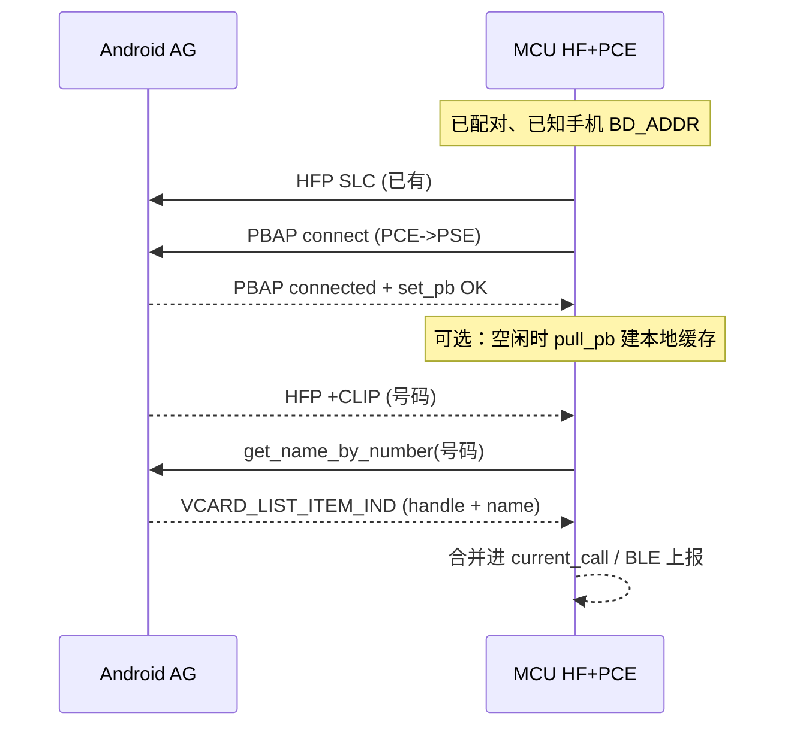

# PBAP 联系人解析（MCU）— 实施计划

面向：**应用层不能读系统通讯录**（审核）时，在 **MCU + 经典蓝牙** 侧用 **PBAP（Phone Book Access Profile）** 从手机拉取电话本 / 按号码反查显示名。

本文基于 **SiFli SDK** 中与 PBAP Client 相关的实现整理，便于排期与落地。

---

## 1. 目标与边界

| 目标 | 说明 |
|------|------|
| 来电时展示 **联系人显示名**（或至少「可能匹配」） | 依赖 PBAP **vCard-Listing** 中带 `name` 的条目，或全量同步后本地匹配 |
| **不依赖** Android App `READ_CONTACTS` | 全部由 **蓝牙 PBAP** 完成 |

**边界**：PBAP 解决的是「设备侧从手机拉电话本」；与 **HFP `+CLIP`** 仍是两条通道——通常先有用 **号码**（CLIP），再用 **PBAP 查名**。

---

## 2. SiFli SDK 能力盘点（已存在代码）

### 2.1 编译与角色

- **`CFG_PBAP_CLT`**：`bts2_app_pbap_c.c` / `bts2_app_pbap_c.h` — PBAP **PCE（Client）**，连接手机上的 **PSE（Server）**。
- **`BT_USING_PBAP`**：`bt_rt_device_urc_pbap.c`、`bt_rt_device_control_pbap.c` — RT-Device 层把 PBAP 事件/控制命令接出来。

工程需在 **menuconfig / rtconfig** 中同时打开上述（及依赖栈选项），与现有 **HFP** 共存；同一 ACL 上 **HFP + PBAP** 一般为常见组合。

### 2.2 连接 API（与 HFP 同模式）

- **`bt_interface_conn_ext(mac, BT_PROFILE_PBAP)`**  
  → `bts2_app_interface.c` 中映射为 `BT_NOTIFY_PBAP_PROFILE` / `bt_pbap_client_connect_request(&bd, FALSE)`。
- **`bt_pbap_client_disconnect(&bd)`** — 断开 PBAP。

连接结果在 **`bts2_app_pbap_c.c` → `BTS2MU_PBAP_CLT_CONN_CFM`**：成功则 `pbap_clt_st = BT_PBAPC_CONNED_ST`，并 **自动** `bt_pbap_client_set_pb(PBAP_LOCAL, PBAP_PB)` 设置当前电话本。

### 2.3 按号码查名（与来电号码对齐）

- **`bt_pbap_client_get_name_by_number(char *phone_number, U16 phone_len)`**  
  内部 **`pbap_clt_pull_vcard_list_req(..., PBAP_SEARCH_NUMBER, phone_number, phone_len, ...)`**（见 `bts2_app_pbap_c.c`）。
- **前提**：`local_inst->pbap_clt_st == BT_PBAPC_CONNED_ST`（已有 OBEX/PBAP 会话）；SDK 注释写明无会话会直接返回失败。

### 2.4 结果回调路径

- 列表 XML 由 **`bt_pbapc_parse_vcard_list`** 解析，对每个 `<card ... handle="..." name="..."/>` 填充 **`bt_notify_pbap_vcard_listing_item_t`**（`vcard_handle`、`vcard_name` 等），并调用：  
  **`bt_interface_bt_event_notify(BT_NOTIFY_PBAP, BT_NOTIFY_PBAP_VCARD_LIST_ITEM_IND, ...)`**
- 列表结束：**`BT_NOTIFY_PBAP_VCARD_LIST_CMPL`**

上层在 **`bt_rt_device_urc.c`**（`BT_USING_PBAP`）中进入 **`bt_sifli_notify_pbap_event_hdl`**，最终可到 **`urc_func_pbap_vcard_list_notify`**（若使用 RT-Device 事件桥）。

### 2.5 其它 API（可选策略）

| API | 用途 |
|-----|------|
| `bt_pbap_client_pull_pb` | 拉整本 vCard（解析器 `CARD_Parse`），适合 **后台全量同步** 做本地 DB |
| `bt_pbap_client_pull_vcard_list` | SDK 内示例曾写死 `"10086"` 测搜号；生产应走 **`get_name_by_number`** 或封装好的 search |
| `bt_pbap_client_auth` | 手机发起鉴权时响应（`BTS2MU_PBAP_CLT_AUTH_IND`） |

### 2.6 已知 SDK 备注（风险）

- `bt_device_control_pbap.c` 里 **`BT_CONTROL_PBAP_PULL_VCARD_LIST` / `PULL_VCARD_ENTRY` 标为 to do** — 若你们走 **ioctl/控制面** 封装，需确认是否直接调 **`bt_pbap_client_*`** 即可，不必依赖这两条 control cmd。
- `bt_pbap_client_connect_request` 注释中有 **MTU / 部分机型** 相关历史问题（如小米）；若遇兼容问题，需结合 SiFli 发布说明或抓 OBEX 日志调参。

---

## 3. 推荐总体流程

---

## 4. 两种产品策略（二选一或组合）

### 策略 A — 来电后按需查询（实现快、流量小）

1. HFP 已连接，`+CLIP` 收到 **号码**。
2. 若 **PBAP 未连接**：先 **`bt_interface_conn_ext(..., BT_PROFILE_PBAP)`**，等待 **`BT_NOTIFY_PBAP_PROFILE_CONNECTED`**（及内部 `set_pb` 完成，可通过日志或短暂延时/状态机确认）。
3. 调用 **`bt_pbap_client_get_name_by_number`**（号码与 CLIP 一致，注意 **归一化**：去空格、国际前缀等，与 PBAP 搜索行为一致需实机验证）。
4. 在 **`BT_NOTIFY_PBAP_VCARD_LIST_ITEM_IND`** 里取 **`vcard_name`**；在 **`VCARD_LIST_CMPL`** 里结束本次查询。
5. **超时**：无匹配则显示纯号码。

**风险**：首通电话若 PBAP 才建链，**首包名字延迟** 可能数百 ms～数秒；需在 UI/协议上容忍「先号后名」。

### 策略 B — 空闲时全量/增量同步（体验稳、工程大）

1. PBAP 连接成功后周期性或在充电空闲时 **`bt_pbap_client_pull_pb`**，解析 vCard 写入 **Flash 小型 KV/表**（号码 → 名）。
2. 来电时 **只做本地查表**，无需等 PBAP  round-trip。

**风险**：存储、解析耗时、隐私与合规说明（电话本落 MCU）。

---

## 5. MCU 固件任务清单（建议顺序）

1. **配置**：打开 `CFG_PBAP_CLT`、`BT_USING_PBAP`，确认 RAM/栈与多 profile 同时连接资源足够。
2. **事件注册**：在现有 `bt_interface_register_bt_event_notify_callback` 路径中增加 **`type == BT_NOTIFY_PBAP`** 分支，处理：  
   `PROFILE_CONNECTED` / `DISCONNECTED`、`VCARD_LIST_ITEM_IND`、`VCARD_LIST_CMPL`、必要时 **`AUTH`**。
3. **与 HFP 状态机协作**：在 **`BT_NOTIFY_HF_CLIP_IND`**（或你们合并后的 `current_call.number`）之后触发 **策略 A** 的 `get_name_by_number`；注意 **单线程/命令互斥**（SDK 里 `curr_cmd` 非 IDLE 时会拒绝新操作）。
4. **号码归一化**：CLIP 与 PBAP 搜索可能对 `+86`、空格敏感——建议统一一种 **digit-only** 或 E.164 尝试规则，并记录失败回退。
5. **鉴权**：若手机弹出 PBAP 配对码，实现 **`bt_pbap_client_auth`** 的 UI 或固定流程（测试机先手动验证）。
6. **BLE / JSON-RPC**：若需手机 App 仅展示，扩展 **`call_state` 或 `device_info`** 增加 `caller_name`（可选，**仍可不读系统通讯录**）。
7. **测试矩阵**：2～3 款 Android 版本 + 中英文联系人 + 双卡（`PBAP_LOCAL` / SIM 仓库若需切换，查 `BTS2E_PBAP_PHONE_REPOSITORY` 与 `set_pb`）。

---

## 6. 与「仅 HFP」的关系

- **HFP**：来电状态 + **号码**（`+CLIP` / CLCC）。
- **PBAP**：**电话本数据**，用于 **号码 → 显示名**；**不能**替代 HFP 通话控制。

---

## 7. 文档与代码索引（SiFli SDK）

| 内容 | 路径 |
|------|------|
| PBAP Client 实现 | `middleware/bluetooth/service/bt/bt_finsh/bts2_app_pbap_c.c` |
| 对外声明 | `middleware/bluetooth/service/bt/bt_finsh/bts2_app_pbap_c.h` |
| Profile 连接封装 | `middleware/bluetooth/service/bt/bt_finsh/bts2_app_interface.c`（`BT_PROFILE_PBAP`） |
| 事件类型 | `middleware/bluetooth/service/bt/bt_finsh/bts2_app_interface_type.h`（`BT_NOTIFY_PBAP_*`） |
| RT-Device URC | `middleware/bluetooth/service/bt/bt_rt_device/bt_rt_device_urc_pbap.c` |
| Control 封装 | `middleware/bluetooth/service/bt/bt_rt_device/bt_rt_device_control_pbap.c` |
| 交互菜单参考 | `middleware/bluetooth/service/bt/bt_finsh/bts2_app_menu.c`（搜索 `CFG_PBAP_CLT`、`bt_pbap_client_connect_request`） |

**说明**：`example/bt/hfp` **仅演示 HFP**，不含 PBAP；PBAP 需按上文在 **产品固件** 中集成，而非复制 HFP example 即可。

---

## 8. 验收标准（建议）

- [ ] 手机已配对，仅操作手表/耳机侧，**无需 App 通讯录权限**，来电可显示 **与系统通讯录一致或接近** 的显示名（视策略 A/B）。
- [ ] PBAP 断开后可自动重连或下次来电可再次拉起。
- [ ] 无 PBAP 匹配时仍只显示号码，**不崩溃、不阻塞** HFP 接听。

---

*文档版本：与当前 SiFli SDK 树源码一致；若 SDK 升级，请以 `bts2_app_pbap_c.c` 为准复核 API。*

---

## 9. 已落地（策略 A，MCU + BLE）

| 项 | 说明 |
|----|------|
| Kconfig | `project_525/proj.conf` / `project_52j/proj.conf`：`CONFIG_CFG_PBAP_CLT=y` |
| MCU | `mcu/src/bt/bt_pbap_contact.c`：`+CLIP` → `bt_interface_conn_ext(PBAP)` → 延时 `bt_pbap_client_get_name_by_number` → `BT_NOTIFY_PBAP_VCARD_LIST_*` → 填 `current_call.caller/title` → `protocol_send_caller_resolved` → `VCARD_LIST_CMPL` 后 `bt_interface_disc_ext(PBAP)` |
| 事件 | `bt_hfp_events.c`：`BT_NOTIFY_PBAP` 转发到 `bt_pbap_contact_on_notify`；`BT_NOTIFY_HF_CLIP_IND` 后调用 `bt_pbap_contact_request_for_number` |
| 协议 | `type`: **`caller_resolved`**（`protocol.h`：`PROTO_TYPE_CALLER_RESOLVED`），字段含 `uid`、`sid`、`title`、`caller`、`number`、`from_pbap`、**`is_contact`**（1=PBAP 有匹配，0=搜完无匹配=陌生人）；与 iOS `IncomingCallContext.callerType` / Android `LiveCallIncomingWebSocket` hello 中 `callerType`+Opus 对齐 |
| Android | `BleControlDispatch.kt`：`caller_resolved` → 复用 `IncomingCall` / `CallMateBleEvent.IncomingCall` 刷新展示（无通讯录权限） |
